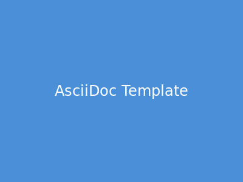

include::config.adoc[]

= AsciiDoc Template サンプルドキュメント

== はじめに

このドキュメントは、AsciiDoc Templateリポジトリの動作確認用サンプルです。
GitHub Actionsを使用してHTMLとPDFを自動生成できます。

== 機能一覧

=== テキストフォーマット

*太字* 、 _斜体_ 、 `等幅フォント` などの基本的なフォーマットが使用できます。

=== リスト

.順序なしリスト
* 項目1
* 項目2
* 項目3

.順序付きリスト
. 最初の項目
. 2番目の項目
. 3番目の項目

=== コードブロック

[source,bash]
----
#!/bin/bash
echo "Hello, AsciiDoc!"
----

=== テーブル

[cols="1,2,3"]
|===
|ヘッダー1 |ヘッダー2 |ヘッダー3

|セル1
|セル2
|セル3

|セル4
|セル5
|セル6
|===

=== 引用

[quote, AsciiDoc公式ドキュメント]
____
AsciiDocは、メモ、ドキュメント、記事、書籍、スライドショー、Webページ、manページなどを作成するためのテキストドキュメント形式です。
____

=== 画像

以下はサンプル画像です:

.サンプル画像

=== Mermaid図

以下はMermaidを使用したフローチャートの例です:

.ドキュメントビルドフロー
[mermaid]
----
flowchart TD
    A[AsciiDocファイル編集] --> B{ビルド方法}
    B -->|ローカル| C[Docker build]
    B -->|CI/CD| D[GitHub Actions]
    C --> E[docker run]
    D --> F[タグプッシュ or 手動実行]
    E --> G[output/ディレクトリ]
    F --> G
    G --> H[HTML]
    G --> I[PDF]
----

以下はシーケンス図の例です:

.ビルドプロセスのシーケンス
[mermaid]
----
sequenceDiagram
    participant User as ユーザー
    participant Docker as Dockerコンテナ
    participant Asciidoctor as Asciidoctor
    participant Output as 出力ファイル

    User->>Docker: docker run
    Docker->>Asciidoctor: build.sh実行
    Asciidoctor->>Asciidoctor: HTML生成
    Asciidoctor->>Asciidoctor: PDF生成
    Asciidoctor->>Output: ファイル出力
    Output->>User: HTML/PDFダウンロード
----

== ビルド方法

Dockerを使用してビルドできます:

[source,bash]
----
docker build -t adoc-builder .
docker run --rm -v $(pwd)/docs:/docs:ro -v $(pwd)/output:/output adoc-builder
----

ビルド成果物は `output/` ディレクトリに出力されます。

== まとめ

このテンプレートを使用することで、AsciiDocドキュメントを簡単にHTMLやPDFに変換できます。
